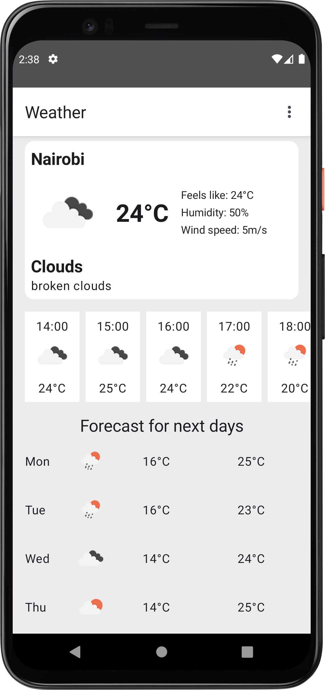
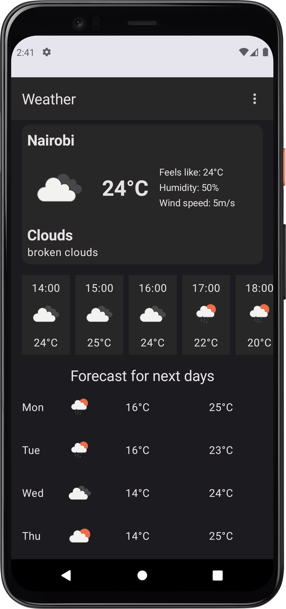

# Weather
This is a sample android app that uses location services to get current weather information of user's location.

The weather information is fetched from [OpenWeatherMap](https://openweathermap.org/)'s [One Call API 3.0.](https://openweathermap.org/api/one-call-3)

## Setup
- Obtain an API key from [OpenWeatherMap](https://openweathermap.org/)
- Once you have the key, add this line to the `local.properties` file:
```
OPEN_WEATHER_API_KEY = <YOUR_API_KEY>
```

## Screenshots
 &nbsp; 